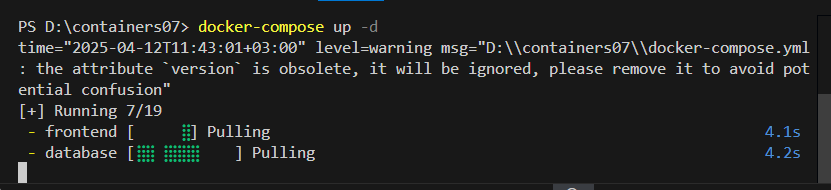

# Лабораторная работа №7: Создание многоконтейнерного приложения

**Выполнила:** Годорожа Оксана, группа I2302  
**Дата:** 12 апреля 2025 г.

## Цель работы
Ознакомиться с работой многоконтейнерного приложения на базе docker-compose.

## Задание
Создать PHP-приложение на базе трех контейнеров: nginx, php-fpm, mariadb, используя docker-compose.

## Описание выполнения работы

### Подготовка

1. Скопировала репозиторий :
   ```bash
   git clone
   ```
   

### Сайт на PHP

1. Создала директорию `mounts/site`:
   ```bash
   mkdir -p mounts/site
   ```


2. Скопировала файлы PHP-сайта из лабораторной работы №1 в директорию `mounts/site`, `index.php`.


### Конфигурационные файлы

1. Создала файл `.gitignore` в корне проекта со следующим содержимым:

   ```bash
   # Ignore files and directories
   mounts/site/*
   ```
   

2. Создала директорию `nginx`:
   ```bash
   mkdir nginx
   ```

3. Создала файл `nginx/default.conf` с конфигурацией Nginx:

   ```nginx
   server {
       listen 80;
       server_name _;
       root /var/www/html;
       index index.php;
       location / {
           try_files $uri $uri/ /index.php?$args;
       }
       location ~ \.php$ {
           fastcgi_pass backend:9000;
           fastcgi_index index.php;
           fastcgi_param SCRIPT_FILENAME $document_root$fastcgi_script_name;
           include fastcgi_params;
       }
   }
   ```

4. Создала файл `docker-compose.yml` в корне проекта:

   ```yaml
    version: '3.9'

    services:
      frontend:
        image: nginx:1.19
        volumes:
          - ./mounts/site:/var/www/html
          - ./nginx/default.conf:/etc/nginx/conf.d/default.conf
        ports:
          - "80:80"
        networks:
          - internal
      backend:
        image: php:7.4-fpm
        volumes:
          - ./mounts/site:/var/www/html
        networks:
          - internal
        env_file:
          - mysql.env
      database:
        image: mysql:8.0
        env_file:
          - mysql.env
        networks:
          - internal
        volumes:
          - db_data:/var/lib/mysql

    networks:
      internal: {}

    volumes:
      db_data: {}
   ```
   

5. Создала файл `mysql.env` в корне проекта:
   ```bash
   MYSQL_ROOT_PASSWORD=secret
   MYSQL_DATABASE=app
   MYSQL_USER=user
   MYSQL_PASSWORD=secret
   ```

### Запуск и тестирование
1. Запустила контейнеры командой:

   ```bash
   docker-compose up -d
   ```
   

   

  

2. Проверила статус контейнеров:

   Все три контейнера: `frontend`, `backend`, `database` были активны.
   

3. Открыла браузер и перешела по адресу `http://localhost`. Сайт отобразился корректно, подтверждая работу PHP-приложения через Nginx и php-fpm.


### Ответы на вопросы

1. **В каком порядке запускаются контейнеры?**  
    Порядок не фиксирован, но `database` часто стартует первым, так как не зависит от других. В нашем `docker-compose.yml` нет `depends_on`, поэтому frontend, backend и database запускаются одновременно. Это быстро, но backend может не найти базу, если она еще не готова. Как я предпологаю лучше сделать так:
    ``` yaml
    frontend:
    depends_on:
          - backend
      backend:
        depends_on:
          - database
    ```
   `database` стартует первой, потом `backend`, затем `frontend`. Для проверки можно добавить `healthcheck` на `database`, чтобы `backend` дождался ее готовности.

2. **Где хранятся данные базы данных?**  
   Данные базы хранятся в Docker-томе `db_data`, подключенном к контейнеру `database` по пути `/var/lib/mysql`.

   

3. **Как называются контейнеры проекта?**  
   Контейнеры именуются как: `containers07-<сервис>-1`:  
   - `frontend` → `containers07-frontend-1`  
   - `backend` → `containers07-backend-1`  
   - `database` → `containers07-database-1`

    

4. **Как добавить файл `app.env` с переменной `APP_VERSION` для `backend` и `frontend`?**  

Создаю файл `app.env` в корне проекта с текстом `APP_VERSION=1.0.0`.  

В `docker-compose.yml` добавляю:  
- для `frontend`: `env_file: - app.env`  
- для `backend`: `env_file: - mysql.env - app.env`  .  

После просто нужно перезапустить: `docker-compose down && docker-compose up -d`.

Хранение `APP_VERSION` в отдельном файле app.env упрощает управление настройками, особенно если переменных станет больше.

## Выводы

В ходе лабораторной работы создано многоконтейнерное PHP-приложение с использованием Docker Compose. Реализованы три сервиса: nginx (frontend), php-fpm (backend) и mysql (база данных). Освоены ключевые приёмы работы с Docker Compose: настройка docker-compose.yml, монтирование томов, сети и переменные окружения. Приложение успешно запущено и протестировано на http://localhost

## Библиография

 - Dmitry Mosk – «Шпаргалка по работе с docker-compose(https://www.dmosk.ru/miniinstruktions.php?mini=docker-compose-examples​)

  -  Руководство по Docker Compose для начинающих( https://habr.com/ru/companies/ruvds/articles/450312/)
